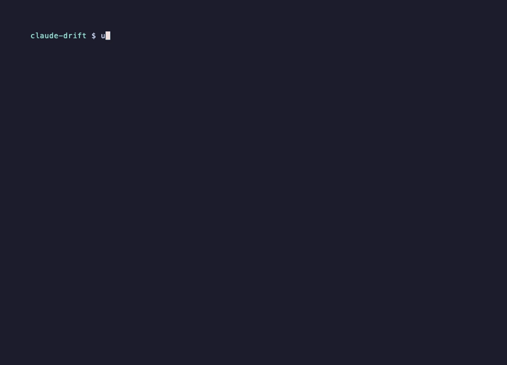

# claude-drift

Replay your own Claude Code sessions against a new model and see what actually changed. Replaying
Opus 5 against itself, it reproduced its own next action 80% of the time but matched the action in
the recorded session only 35% of the time — so a raw "the model changed" number is mostly measuring
your replay setup, and you need the same-model control to tell drift from noise.



## What it is

- No config. No API key. Uses your existing `claude` login and the sessions already in `~/.claude/projects`.
- Teacher-forced single-step replay: the new model sees exactly the context the old one saw and proposes one next action. No tools run.
- A same-model control: the old model is replayed against the same cuts, so every number comes with a noise band.
- `--self-replays N` replays the old model against itself, separating the model's own sampling instability from replay-vs-interactive mismatch.
- Per-transition changes are reported as REAL or NOISE with a bootstrap interval, Bonferroni-corrected over the transitions tested.

## The number, and why you need the control

From a real run on the author's machine, 20 turns across 5 sessions, `claude-opus-5` recorded and
`sonnet` as the candidate:

```
next-action agreement: 25%  (noise band 14%-58%)
old-vs-record agreement: 35%
old-vs-old self-agreement (k=5 measured): 80%  (band 63%-88%)
interpretation: the old model mostly reproduces itself; the gap to the record is replay-vs-interactive mismatch, not model instability
verdict: no detectable drift (candidate agreement inside noise band)
agreement by level: tool 30% / target 25% / full 25%
```

Read naively, the candidate picked a different next action than the record on 75% of turns, which
sounds like a large behaviour change. But the old model disagreed with its own recorded action on
65% of turns, and disagreed with itself across five draws on only 20% — most of that gap is the
replay regime (`claude -p`, hooks and plugin state, thinking budget), not the model. Against that
band the candidate sits inside the noise, so on these 20 turns there is no detectable drift.

## Install

Not on PyPI yet. Run it straight from GitHub with uv:

```bash
uvx --from git+https://github.com/mandu5/claude-drift drift scan
```

or clone and `uv sync` (see Development). `uvx claude-drift` / `pip install claude-drift` will
work once the first release is published.

## Use

```bash
drift scan                                   # what is replayable on this machine (no model calls)
drift replay --from opus-5 --to sonnet-5     # replay 30 sampled turns with both models
drift report                                 # re-render the last run (no model calls)
drift resume                                 # finish the replays a cut-off run left pending
```

30 turns is the default so one run fits inside a subscription window. Use `drift resume` if a run
is cut off.

Example output: see [docs/examples/first-report.md](docs/examples/first-report.md).

### Options for `drift replay`

| option | default | what it does |
|---|---|---|
| `--from TEXT` | required | Recorded model to select turns from, e.g. `opus-5` or `claude-opus-5`. |
| `--to TEXT` | required | Model to replay with, passed to `claude --model`. |
| `--turns N` | 30 | How many recorded turns to sample and replay. |
| `--per-session N` | 3 | Max cuts sampled from one session. |
| `--self-replays N` | 1 | Old-model replays per cut. Above 1 the report also gives old-vs-old self-agreement, which separates the model's own sampling instability from replay-vs-interactive mismatch. Multiplies cost. Use 5 once to calibrate your setup, then go back to 1. |
| `--workers N` | 4 | Replays in flight at once. Sessions are batched so one worker owns a session. |
| `--no-noise` | off | Skip the old-model replay. Faster and half the cost, but no noise band and no verdict. |
| `--project PATH` | all | Only replay sessions whose working directory is under `PATH`. Also on `drift scan`. |
| `--seed N` | 0 | Seed for sampling and for the bootstrap, so a run is reproducible. |
| `--timeout SECONDS` | 180 | Per-replay wall clock. A replay that exceeds it is killed and counted as failed. |
| `-y`, `--yes` | off | Skip the cost confirmation prompt. |

### What is stored

Each run writes a directory under `~/.claude-drift/runs/` holding the sampled prompts, the raw
tool inputs of both the recorded and the proposed actions, and the rendered report. That is your
own session content sitting on your own disk; delete the directory to remove it.

If a replay is interrupted (Ctrl-C or SIGTERM) in-flight replays finish first so temporary
session copies are always removed; the run is marked `interrupted`.

## How it works

1. **ingest** — finds human prompts in your session logs that were followed by a tool call.
2. **sample** — picks up to 30 turns, stratified by tool, at most 3 per session, seeded.
3. **replay** — writes a truncated copy of the session next to the original under a temporary id
   and runs `claude -p --resume <id> --fork-session --model <new> --max-turns 1`. The primary
   guarantee that nothing runs is the stop itself: the stream is read only up to the first
   `tool_use` block and the process is killed there, before any tool can execute. As a second
   layer, a PreToolUse hook that blocks every tool is passed via `--settings`. That hook was
   never exercised in testing, because the stop always happens first. `--settings` merges rather
   than replaces, so your own hooks and plugins still load during a replay. The temporary file
   is deleted afterwards, and the original session file is never written to.
4. **classify** — normalises each action to `tool/target` (e.g. `Bash/local-read`, `Read/local-read`,
   `Agent/delegate`, `Bash/remote`).
5. **stats** — agreement with the recorded action for the new model and for the old model; a
   bootstrap 95% band of old-vs-record agreement is the noise floor. The bootstrap resamples
   sessions, not turns, because turns from one session are not independent. Transitions whose
   new-minus-old count has a bootstrap interval excluding zero are reported as REAL, with the
   interval Bonferroni-corrected over the number of transitions tested. Transitions are
   enumerated from what the new model did differently, so a cut where only the old model drifted
   away from the record is not listed in v1.
6. **report** — text or markdown.

## Cost

Each replayed turn sends the session prefix again (typically 30k–100k tokens, mostly cached).
Default settings replay 30 turns twice, once per model. The run quoted above used
`--turns 20 --per-session 8 --self-replays 5`, which is 120 replays (20 candidate, 100 old-model):

| | |
|---|---|
| replays | 120 |
| cache-creation input tokens | 27.8M |
| cache-read input tokens | 11.3M |
| wall clock at 4 workers | about 20 min |

That run hit the subscription session limit partway through and was finished with `drift resume`,
so the wall clock excludes the wait for the window to reset. `--self-replays 5` is what makes it
expensive; the default of 1 costs about a third of this for the same number of turns.
`drift replay` prints an estimate and asks before starting.

## Limits

- Only turns after a human-typed prompt are replayed; turns after tool results are skipped in v1.
- Only Claude models, because only Claude Code sessions are read.
- Results describe *next-action* drift, not end-to-end task outcomes.
- Replays inherit your local plugins and hooks, so reports are not directly comparable across
  machines.
- The self-replay control measures instability under `claude -p`; it does not reproduce the
  interactive session's thinking budget or the plugin state at recording time, so old-vs-record
  agreement is a lower bound.

## Related

- [delta-hq/cc-canary](https://github.com/delta-hq/cc-canary) — descriptive statistics over Claude Code session logs; it never calls a model.
- [sshh12/agent-pr-replay](https://github.com/sshh12/agent-pr-replay) — end-to-end re-execution of agent tasks, without teacher forcing and without a same-model control.

As far as we know, `claude-drift` is the only tool that replays the old model against itself to
separate drift from noise.

## Development

```bash
uv sync
uv run pytest -q
uv run ruff check .
uv run mypy
```

The live probe that shells out to a real `claude` process is opt-in:

```bash
DRIFT_LIVE=1 uv run pytest tests/test_replay_live.py -s
```

### Releasing

```bash
git tag v0.1.0 && git push --tags
```

A `v*` tag runs `.github/workflows/publish.yml`, which builds the wheel and uploads it to the
PyPI project `claude-drift` through trusted publishing from the `pypi` environment. No token is
stored in the repository.

## License

MIT
